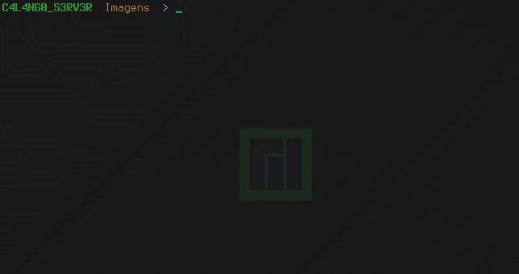

# Change the PS1 from the Terminal

* The configuration file is in **~/.bashrc**

### MY PS1

* `PS1='\[033[01;32m\] C4L4NG0_S3RV3R \[033[01;33m\] \W \[033[0;00m\] $(__git_ps1 " (%s)") > '`

* Whats is this?
    * `\[033[01;32m\]` is the Green Color
    * `C4L4NG0_S3RV3R` is a text I insert on PS1
    * `\[033[01;33m\]` is the Orange Color
    * `\W` is tho show only the actual Directory on Terminal
    * `\[033[0;00m\]` is to Stop the colors
    * `$(__git_ps1 " (%s)")` is the git information on PS1
    * `>` after this simbol you can insert commands on terminal

### Git Configuration

* You can see informations about the status from a Repository cloned on your computer, for that you need to do the Following:

1. Create the bash_git with this command:
    * `curl -L https://raw.github.com/git/git/master/contrib/completion/git-prompt.sh > ~/.bash_git`
2. In the end of the **~/.bashrc** insert this two lines:
    * `source ~/.bash_git`
    * `export GIT_PS1_SHOWDIRTYSTATE=1`
3. Now go to your PS1 and insert this command:
    * `$(__git_ps1 " (%s)")`

### Visualization

