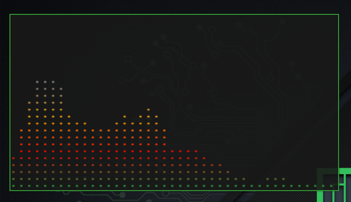

# CLI-VISUALIZER SYSTEM



* Cli-visualizer is a program to show the sound on the terminal
* DOWNLOAD: 
	* Download the following packages: `sudo pacman -S ncurses fftw cmake`
	* Clone the Repo: `https://github.com/dpayne/cli-visualizer.git`
	* Open the Repo and run the **install.sh** file: `./install.sh`
* RUN: run on terminal with the command **vis**
* CONFIG FILE LOCATION: **~/.config/vis/config**
* COLOR DIRECTORY: **~/.config/vis/colors/**

### CHANGE COLORS

* You can change colors inserting in a file in the **colors** directory
* The colors can be in Hexadecimal
* My Example file is **fanto_colors**
* When finished change this line from the **config** file:

```sh
colors.scheme=fanto_colors
```

### CONFIGURATION

* I change the config to only have spectrum 
* My Modifications are in the file **config** on this Directory
