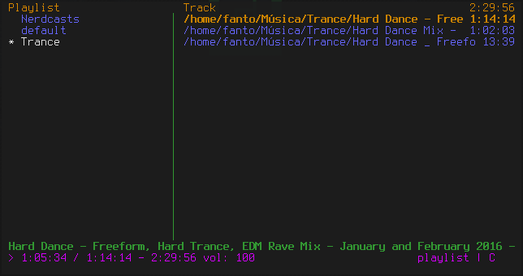

# USINGO CMUS ON LINUX

* Cmus is a lightweight to listen music from terminal

|INFO|WHAT TO DO|
|---|---|
|INSTALLATION| `sudo pacman -S cmus`
|CONFIGURATION FOLDER|**~/.config/cmus**
|HOW TO START|write `cmus` on terminal
|FORCE STOP|write `killall cmus` on terminal

### COMMANDS

* There is a file on this Directory with the commands to use on cmus, [CLICK HERE](COMMANDS.txt)

### COLOR CONFIGURATION

* The Cmus use the 256 Colors, so there is this [Picture](256_colors_bg.png) with the number of the color to insert on the file
* create a file on **~/.config/cmus/** and put the **.theme** extension, mine is **fanto_theme.theme**
* in the cmus, put this command: `:colorscheme fanto_theme` and he is going to change the colors from the file

### MY CONFIGURATION

* Color Configuration [Here](fanto_theme.theme)
* I keep the system basic to quick use, just change the colors

