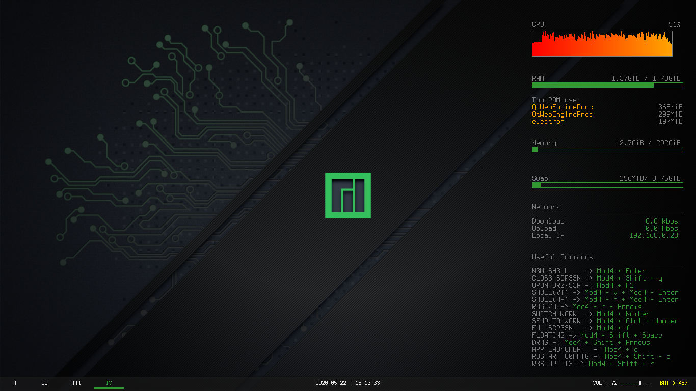

# CONFIGURING CONKY

* Conky will come with the Manjaro i3, but you can update with `sudo pacman -S conky-all`
* The themes for conky are organized in **/usr/share/conky**
* In my sistem they are two ways of doing

### New Conky

* In the Directory **New_Conky** there is the file from my configuration of conky, where the files is loke this:

Name of the file | Used to | the location needed to be
|---|---|---|
conky_fanto|the file with all the information from conky|**/usr/share/conky/**
start_conky_fanto| script to start and restart the conky|**/usr/bin/**

* on the i3 config file (**.i3/config**), after putting the files on his directories, insert this commmand on the i3 config:

```sh
exec --no-startup-id start_conky_fanto
```

* Image from my configuration:



### Old Conky

* it's just the basic configuration from Conky
