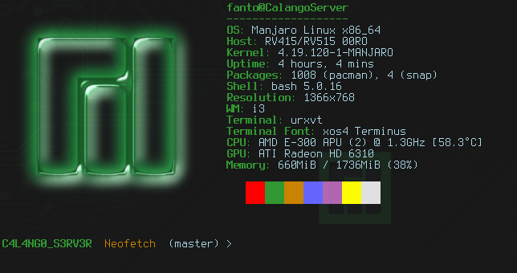

# CONFIGURING THE NEOFETCH

* Neofetch is a program to watch information on terminal

### How to Install

* Install the _w3m_ : `sudo pacman -S w3m`
* Install the Neofetch: `sudo pacman neofetch`

### Information

* CONFIGURATION FILE: **~/.config/neofetch/config.conf**

### RUNNING

* To run the program on terminal: `neofetch`
* To run the program with a custom image: `neofetch --source path/to/image`
* I have two scripts to launch the Neofetch with custom image:
	* _local_launch.sh_ is to launch inside this Repository
	* _launch.sh_ is to launch from my custom i3
