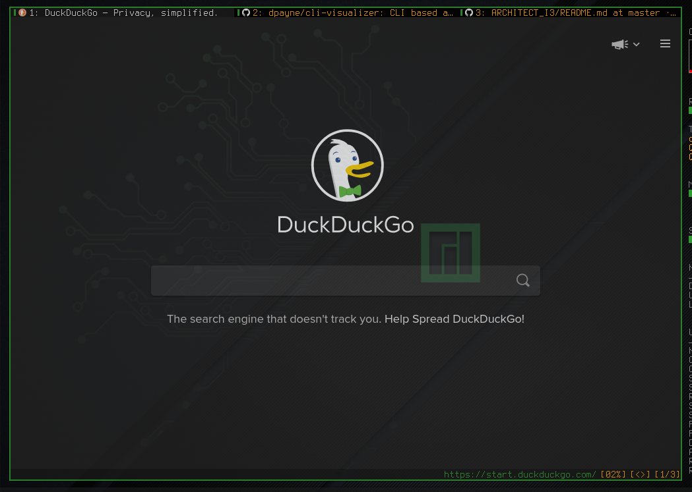

# QUTEBROWSER - THE COMMAND-LINE BROWSER



* The best Browser to use with command-line
* DOWNLOAD: `sudo pacman -S qutebrowser`
* CREATING DEFAULT CONFIGURATION FILE:
	* You need to go to **~/.config/qutebrowser/**
	* Create the file _config.py_ on this Directory
	* Open qutebrowser and call this command: `:config-write-py --defaults`
	* After doing the modifications, call this command on the qutebrowser: `:config-source`

* My Configuration is in the **config.py** file
* The Cheat-sheet of command is [HERE](../Cheat-Sheets/qute_commands.txt)
* I create a Keyboard shortcut to open Qutebrowser on i3wm

```sh
bindsym $mod+F2 exec qutebrowser
```

### Dark Mode on Qutebrowser

* in the **~/.configs/qutebrowser/** you can insert an `.css` file with the colors you want
* then in the qutebrowser insert the following command: `:set content.user_stylesheet stylename.css`
* the **stylename** on my system is **fanto_darktheme.css**

### Qutebrowser Commands

What is the Command|The Command
|---|---|
Reload the Active Page|**:reload** or <kbd>R</kbd>
Back from the Previous Page|**:back**  or <kbd>Shif</kbd> + <kbd>H</kbd>
Open Link on a New Tab|**:open -t Link** or <kbd>Shift</kbd> + <kbd>O</kbd> + Link

