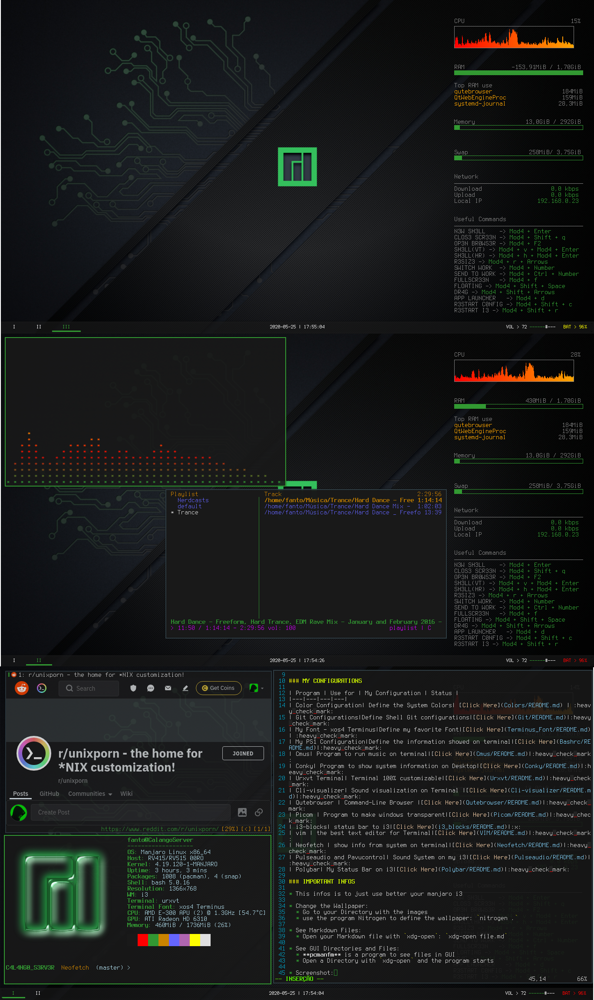

# Welcome to my Configuration!

### MY CHEAT-SHEETS

* [TMUX](Cheat-Sheets/TMUX_Commands.txt)
* [I3 COMMANDS](Cheat-Sheets/i3_commands.txt)
* [QUTEBROWSER](Cheat-Sheets/qute_commands.txt)
* [CMUS](Cheat-Sheets/cmus_command.txt)

### MY CONFIGURATIONS

| Program | Use for | My Configuration | Status |
|---|---|---|---|
| Color Configuration| Define the System Colors| [Click Here](Colors/README.md) | :heavy_check_mark:
| Git Configurations|Define Shell Git configurations|[Click Here](Git/README.md)|:heavy_check_mark:
| My Font - xos4 Terminus|Define my favorite Font|[Click Here](Terminus_Font/README.md)| :heavy_check_mark:
| My PS1 Configuration|Define the information showed on terminal|[Click Here](Bashrc/README.md)|:heavy_check_mark:
| Cmus|	Program to run music on terminal|[Click Here](Cmus/README.md)|:heavy_check_mark:
| Conky| Program to show system information on Desktop|[Click Here](Conky/README.md)|:heavy_check_mark:
| Urxvt Terminal| Terminal 100% customizable|[Click Here](Urxvt/README.md)|:heavy_check_mark:
| Cli-visualizer| Sound visualization on Terminal |[Click Here](Cli-visualizer/README.md)|:heavy_check_mark:
| Qutebrowser | Command-Line Browser |[Click Here](Qutebrowser/README.md)|:heavy_check_mark:
| Picom | Program to make windows transparent|[Click Here](Picom/README.md)|:heavy_check_mark:
| i3-blocks| status bar to i3|[Click Here](i3_blocks/README.md)|:x:
| vim | the best text editor for Terminal|[Click Here](VIM/README.md)|:heavy_check_mark:
| Neofetch | show info from system on terminal|[Click Here](Neofetch/README.md)|:heavy_check_mark:
| Pulseaudio and Pavucontrol| Sound System on my i3|[Click Here](Pulseaudio/README.md)|:heavy_check_mark:
| Polybar| My Status Bar on i3|[Click Here](Polybar/README.md)|:heavy_check_mark:

### IMPORTANT INFOS

* This infos is to just use better your manjaro i3

* Change the Wallpaper: 
	* Go to your Directory with the images
	* use the program Nitrogen to define the wallpaper: `nitrogen .`
	
* See Markdown Files:
	* Open your Markdown file with `xdg-open`: `xdg-open file.md`

* See GUI Directories and Files:
	* **pcmanfm** is a program to see files in GUI
	* Open a Directory with `xdg-open` and the program starts

* Screenshot:
	* to take screenshot on the system, we use **scrot** program
	* to take screenshot from all, use the <kbd>Prt Sc</kbd>
	* You can see all commands use this command on terminal: `man scrot`

* Remove Palemoon:
	* To Remove Palemoon,remove the _palemoon-bin_ package
	* `sudo pacman -R palemoon-bin`

### GOOD PROGRAMS TO USE

For What|Program|How to Download|Info
|---|---|---|---|
Minimalist Video Player for Linux|MPV|`sudo pacman -S mpv`|[Click Here](MPV/README.md)
See all files from terminal|Ranger|`sudo pacman -S ranger`|[Click Here](Ranger/README.md)
Torrent Download for the Command Line|Transmission-cli|`sudo pacman -S transmission-cli`|[Click Here](Transmission/README.md)
To-do List on Terminal|TaskWarrior|`sudo pacman -S task`|[Click Here](TaskWarrior/README.md)
See PDF Files|Zathura|`sudo pacman -S zathura`|[Click Here](Zathura/README.md)
Save the Desktop Screen|`sudo pacman -S recordmydesktop`|
Record the Screen|Peek|`sudo pacman -S peek`|
How to make Rectagles for TUI(Text User Interface)|[Click Heere](Terminus_Font/Symbols.txt)

### LINKS TO THE GITHUBS

|Program|Official Github
|---|---|
Cmus|[https://github.com/cmus/cmus](https://www.github.com/cmus/cmus)
Conky|[https://github.com/brndnmtthws/conky](https://www.github.com/brndnmtthws/conky)
qutebrowser|[https://qutebrowser.org/index.html](https://qutebrowser.org/index.html)
Cli-Visualizer|[https://github.com/dpayne/cli-visualizer](https://github.com/dpayne/cli-visualizer)
Picom|[https://github.com/yshui/picom](https://github.com/yshui/picom)
Neofetch|[https://github.com/dylanaraps/neofetch](https://github.com/dylanaraps/neofetch)
Polybar|[https://github.com/polybar/polybar](https://github.com/polybar/polybar)

