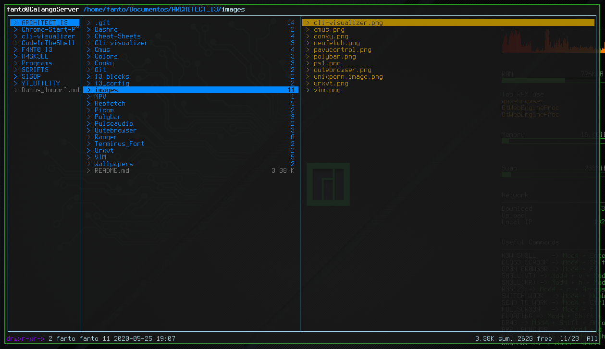

# Ranger - the Terminal File Visualizer

* Ranger is very useful to see all the files and infos from Terminal
* You can see and verify all the images from your system inside Terminal
* This is the Official Github Repo: [Ranger](https://www.github.com/ranger/ranger)

* Configuration Files Location: **~/.config/ranger/**
