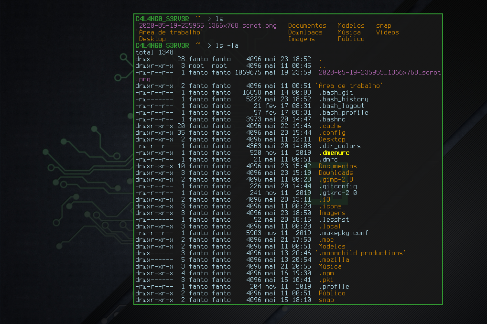

# TERMINAL URXVT

* Urxvt is a terminal 100% configurable
* You can change everything on him, just change the **.Xresource** file.

### INFORMATION

* INSTALLATION: `sudo pacman -S rxvt-unicode`
* The configuration file is **~/.Xresources**
* After doing some modification: `xrdb ~/Xresources`
* My Configuration it's the [.Xresources](.Xresources) file in this Directory
