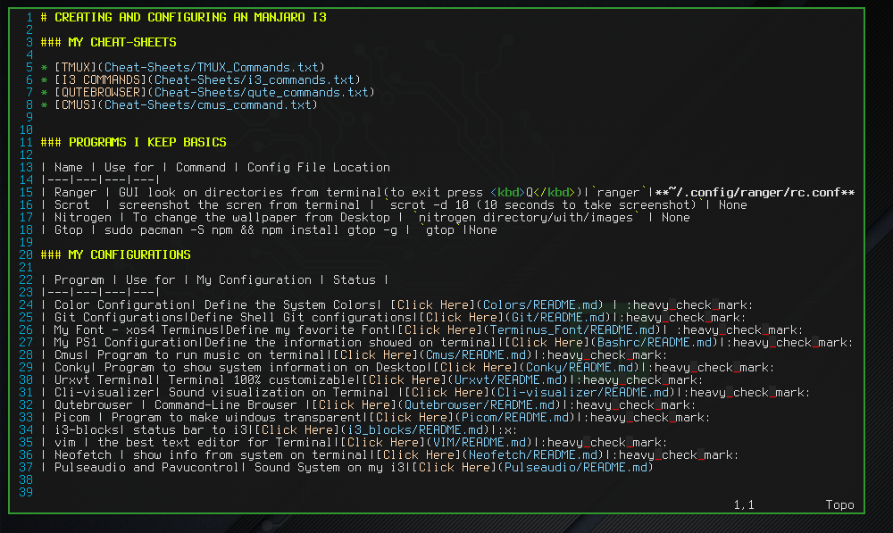

# VIM CONFIGURATION

* VIM is an text editor for terminal very expansible
* It's the best editor you can use, but the most hardwork you need to make



### INFORMATIONS

* On my i3 the informations about vim is found in this locations

| Info | about| location
|---|---|---|
|**vimrc**| the config file from vim | **/etc/vimrc**
|**colorschemes**| all the colorschemes for vim | **/usr/share/vim/vim82/colors**
|**.vimrc**| plugins file for my vim | **~/.vimrc**
### CHANGE COLORSCHEME

* There's a site to create a colorscheme for your VIM: `http://bytefluent.com/vivify/`
* after download your colorscheme, insert him on your colorscheme directory
* Open your vimrc file and insert this command:

```sh
colorscheme name_of_the_scheme
```
### VIM PLUGINS

* We can add Plugins on vim to expando what to do with him
* I will use the vim-plug because is more easy and minimal

**DOWNLOAD VIM-PLUG**

* Use this command on your command-line:

```sh
curl -fLo ~/.vim/autoload/plug.vim --create-dirs https://raw.githubusercontent.com/junegunn/vim-plug/master/plug.vim
```
* Now create a Directory on **~/.vim** with the name **plugged**
* On your **~/.vimrc** file insert this two lines:

```sh
call plug#begin(~/.vim/plugged)

call plug#end()
```
* All the Plugins for vim, they have a single line calling the plugin
* I'll use as Example the `lightline` plugin

**LightLine Plugin**

* Insert this line inside the plug system on **.vimrc**

```sh
call plug#begin(~/.vim/plugged)

Plug 'itchyny/lightline.vim'

call plug#end()
```
* Restart the **.vimrc** using this command inside the file on VIM: `:so %`
* After that, use vim-plug inside the .vimrc with this command: `:PlugInstall`
* It will going to install all plugins on the system
* After that, going to the **/etc/vimrc** file and insert this lines:

```sh
"Keep the last status
set laststatus=2 
```
* Save and open other vim file and thats it!

**MuComplete Plugin**

* Create a Autocomplete options for VIM
* Insert this line on the **.vimrc** file: 

```sh
Plug 'lifepillar/vim-mucomplete'
```
* Restart the file with: `:so %`
* Set to install the Plugin with vim-plug: `:PlugInstall`
* Define this variables on **/etc/vimrc**

```sh
set completeopt+=menuone
set shortmess+=c
```
* For use, just want you need to complete, press <kbd>Tab</kbd>

